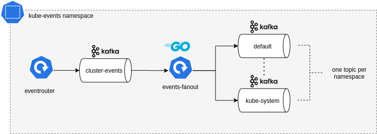

# Kubernetes Events Fanout

## Design

### Objective
- Centralize all Kubernetes cluster events into a Kafka topic
- Fanout of the events in different topics according their namespace of origin

### Moving parts
- Kubernetes events collection uses [Eventrouter](https://github.com/heptiolabs/eventrouter) from HeptioLabs/VMware
- Kafka setup uses [Strimzi](https://strimzi.io/)
- Events dispatch uses a custom Go binary



## How-to run

Install [Strimzi Kafka operator](https://strimzi.io/docs/operators/0.20.1/quickstart.html), follow through the
quickstart guide. In a nutshell:

```shell script
export STRIMZI_NS=kafka
export EVENTS_NS=kube-events

kubectl create ns $STRIMZI_NS
cd k8s/strimzi-0.20.1
sed -i "s/namespace: .*/namespace: $STRIMZI_NS/" install/cluster-operator/*RoleBinding*.yaml

kubectl create ns $EVENTS_NS

# In install/cluster-operator/060-Deployment-strimzi-cluster-operator.yaml
# set env variable `STRIMZI_NAMESPACE` value to $EVENTS_NS

kubectl apply -f install/cluster-operator/ -n $STRIMZI_NS
kubectl apply -f install/cluster-operator/020-RoleBinding-strimzi-cluster-operator.yaml -n $EVENTS_NS
kubectl apply -f install/cluster-operator/032-RoleBinding-strimzi-cluster-operator-topic-operator-delegation.yaml -n $EVENTS_NS
kubectl apply -f install/cluster-operator/031-RoleBinding-strimzi-cluster-operator-entity-operator-delegation.yaml -n $EVENTS_NS
```

Create Kafka brokers and sink topic
```shell script
kubectl -n $EVENTS_NS apply -f k8s/kafka.yaml

# check everything is running OK
kubectl -n $EVENTS_NS get po

NAME                                           READY   STATUS    RESTARTS   AGE
kube-events-zookeeper-1                        1/1     Running   0          3m
kube-events-zookeeper-0                        1/1     Running   0          3m
kube-events-zookeeper-2                        1/1     Running   0          3m
kube-events-kafka-0                            1/1     Running   1          119s
kube-events-kafka-2                            1/1     Running   1          119s
kube-events-kafka-1                            1/1     Running   1          119s
kube-events-entity-operator-745997545f-sxwrl   3/3     Running   2          65s

# after a few seconds, the Kafka topic receiving the cluster events is created
kubectl -n $EVENTS_NS get kafkatopics.kafka.strimzi.io

NAME          CLUSTER   PARTITIONS   REPLICATION FACTOR
cluster-events          1            1
```

Install [EventRouter](https://github.com/heptiolabs/eventrouter)
```shell script 
sed "s/\$EVENTS_NS/$EVENTS_NS/g" k8s/eventrouter.yaml | kubectl -n $EVENTS_NS apply -f -

# check eventrouter is running
kubectl -n $EVENTS_NS get deploy eventrouter

NAME          READY   UP-TO-DATE   AVAILABLE   AGE
eventrouter   1/1     1            1           21m
```

Check kube events are forwarded to the topic
```shell script
kubectl -n $EVENTS_NS exec kube-events-kafka-0 -- bin/kafka-console-consumer.sh \
  --bootstrap-server kube-events-kafka-bootstrap:9092 \
  --topic cluster-events \
  --from-beginning

{"verb":"ADDED","event":{"...":"..."}}

```

Build and push the fanout app Docker image
```
export IMAGE=emmsys/events-fanout

cd events-fanout
make docker-build
docker tag events-fanout:latest $IMAGE:latest
docker push $IMAGE:latest
```

Run the fanout app in Kubernetes
```
sed "s#\$IMAGE#$IMAGE#g" k8s/events-fanout.yaml | kubectl -n $EVENTS_NS apply -f -
kubectl -n $EVENTS_NS wait --for=condition=Ready pod -lapp=events-fanout
```

Check the fanout is working properly
```

# checks new topics are created
kubectl -n $EVENTS_NS get kafkatopics.kafka.strimzi.io

NAME                                                          CLUSTER       PARTITIONS   REPLICATION FACTOR
cluster-events                                                kube-events   1            3
consumer-offsets---84e7a678d08f4bd226872e5cdd4eb527fadc1c6a   kube-events   50           3
kube-system                                                   kube-events   1            3
default                                                       kube-events   1            3
kafka                                                         kube-events   1            3
kube-events                                                   kube-events   1            3

# check one topic content
kubectl -n $EVENTS_NS exec kube-events-kafka-0 -- bin/kafka-console-consumer.sh \
  --bootstrap-server kube-events-kafka-bootstrap:9092 \
  --topic default \
  --from-beginning

{"verb":"ADDED","event":{"metadata":{"name":"k3d-kafka-server-0.16534b6ddac6af33","namespace":"default","...":"..."}}}
```